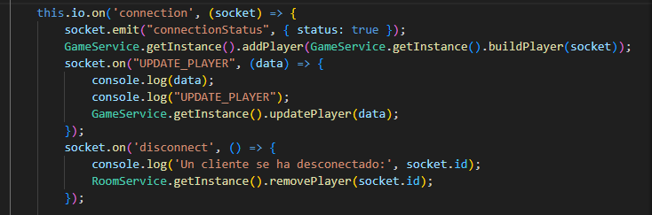
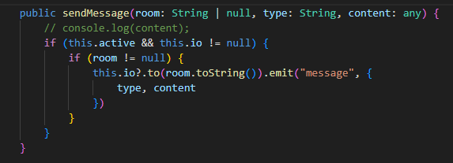
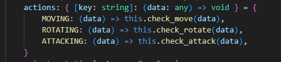
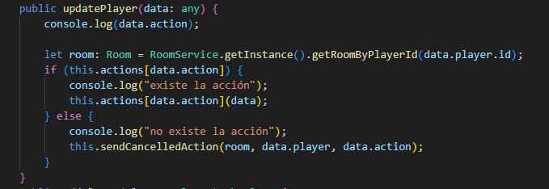
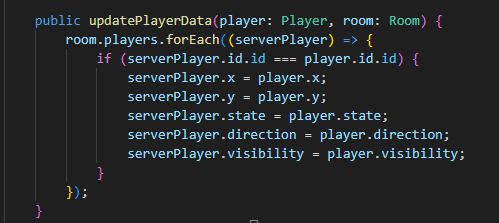
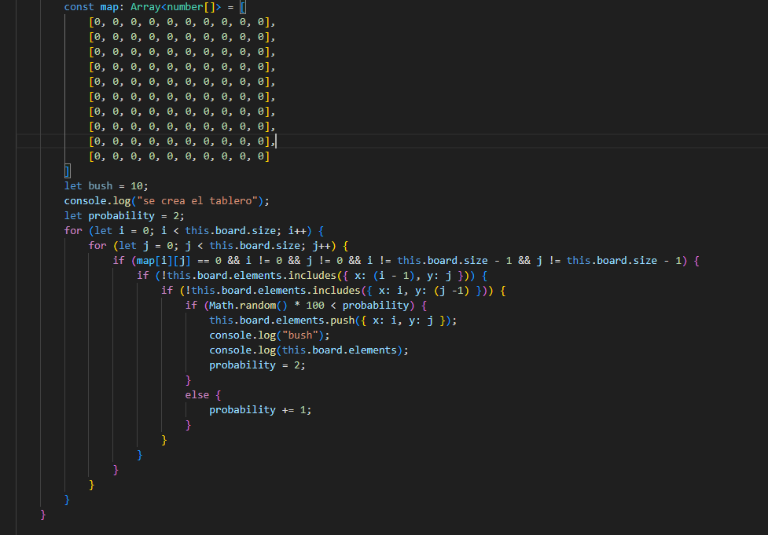
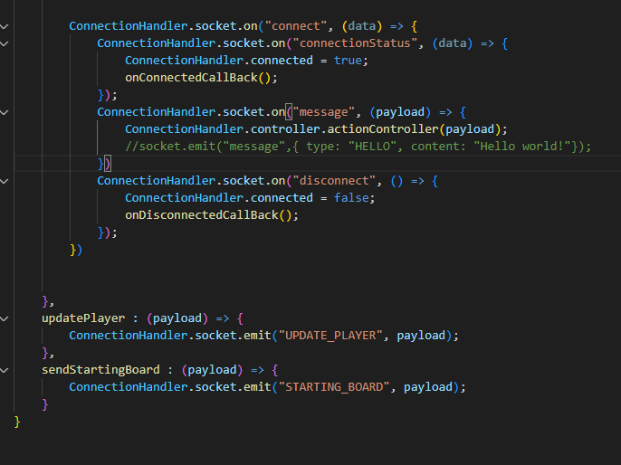
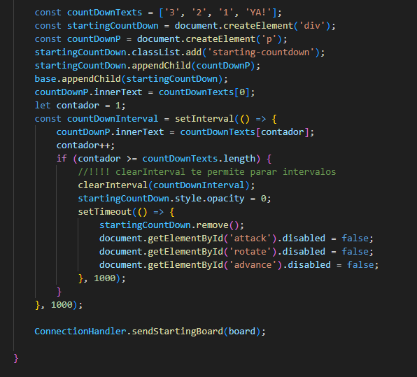

# TamagotchiApp

## Servidor

### ServerService

socket.on("UPDATE_PLAYER") es la vía principal de comunicación entre el cliente y servidor. Se encarga de recibir todas las solicitudes de acción que realizan los clientes.

Su contraparte es sendMessage, que se encarga de enviar las solicitudes revisadas a los clientes bajo un mismo formato de type y content. 
 

### GameService

GameService se encarga de comprobar que las acciones de los clientes son válidas y utiliza un JSON de mensajes válidos y funciones asociadas

La llamada a esas funciones se realiza a través de updatePlayer, que se encarga a su vez de obtener la sala correspondiente a través del método getRoomByPlayerId.

El resto del código de GameService corresponde a las comprobaciones de movimiento, giro y avance, además de comprobar si ha ganado. 
Cabe destacar la función updatePlayerData, que es un mapeo de entidad a entidad para no enviar el socket al mandar el jugador, únicamente se busca enviar su id como referencia.

### RoomService

En RoomService se gestionan los cambios de jugadores en una sala. Tiene funciones para añadir jugadores, encontrarlos por su Id, actualizarlos siguiendo un mapeo de entidad a entidad y eliminarlos. Esta última función destaca un poco más por usar filter, que crea un array nuevo solo con los elementos que pasan el filtro. En este caso se crea un array nuevo con todos los jugadores menos el que entra por parámetro.

### BoardBuilder

La colocación de arbustos de manera aleatoria no ha sido satisfactoria. En el constructor intento establecer condiciones para que no aparezcan arbustos adyacentes y establecer una probabilidad creciente para la aparición de los mismos, pero no funciona correctamente.

## Cliente

### Game Controller

Se encarga de iniciar el connectionHandler y la UI. No la he cambiado con respecto al código que hicimos en clase. Tampoco he cambiado Queue.js.

### ConnectionHandler

Ahora incluye la parte correspondiente al cliente de socket.on("UPDATE_PLAYER") y socket.emit("message") que implementé en el servidor. 

### GameService

Junto con UIv1 es la clase que más cambios ha sufrido. En concreto, GameService engloba todas las funciones que manejan acciones de los jugadores de forma asíncrona gracias a la clase Queue. La función troncal de esta clase es do_updatePlayers, ya que se encarga de establecer las posiciones iniciales y de actualizar los cambios de los jugadores.

### UIv1

UIv1 se encarga de realizar todos los cambios estéticos de la aplicación, implementar los eventListeners de los botones y dibujar el mapa. Su código es muy extenso ya que inicialmente muchas de las comprobaciones de los movimientos del jugador se hacían aquí, lo cual es un error de diseño cometido a propósito para obtener una aplicación funcional la antes posible y ya posteriormente mejorar y arreglar dichos errores.
La falta no me ha permitido dedicarle todo el tiempo posible, por lo que este fin de semana lo he dedicado integramente a resolver este error de diseño.

Dentro de UIv1 cabe destacar el uso de setInterval para mejorar visualmente la interfaz, creando una fase introductoria al juego con una cuenta atrás. Dicha función muestra el siguiente número de la cuenta en cada intervalo, finalizando al terminar la cuenta con clearInterval. 

Esta clase necesita una refactorización considerable y aún conserva algunas comprobaciones que pueden llegar a ser redundantes con las realizadas en el servidor, pero en principio no representa un problema para la funcionalidad del código, por lo que he priorizado otros objetivos.

# Objectivos

## 1. Diseño del Tablero y Mecánicas de Juego

- ✔️ El tablero NxN se genera correctamente, se envían al cliente como array de números y este lo transforma en un array de divs mediante UIv1.drawBoard.
- ✔️ Los jugadores se colocan en las esquinas del tablero con GameService.do_updatePlayers.
- ✔️ Los jugadores pueden atacarse únicamente en la casilla adyacente a la que estén mirando. Esto se comprueba en el servidor con GameService.check_attack.
- ✔️ Se implementan las casillas de escondite, ocultando al jugador parcialmente para uno mismo y totalmente para los rivales, además de no atacar si se encuentra en un arbusto. La mayoría de estas funciones se encuentran en UIv1 ya que son estéticas, además de que el eventListener se encarga de bloquear el ataque desde las casillas correspondientes.

## 2. Comunicación Cliente-Servidor con WebSockets
- ✔️ El servidor envía y recibe mensajes vía WebSocket.
- ✔️ El servidor y el cliente utilizan JSONs con mensajes y funciones predefinidas para simplificar y facilitar el envío de mensajes.
- ✔️ Todos los clientes reciben en tiempo real la información del resto de jugadores.
- ⚠️ El servidor maneja desconexiones sin afectar a la partida, pero no reconexiones. Si vuelves a entrar se te asigna una nueva partida.

## 3. Implementación del Cliente y Eventos del Juego 
- ✔️ Se representan dinámicamente los cambios en el cliente cuando llegan los datos del servidor.
- ✔️ Los 3 eventos de juego se han implementado correctamente.
- ⚠️ La interfaz presenta botones intuitivos, tiempos de espera para el inicio de la partida y un mensaje final para los jugadores con los resultados, aunque es mejorable y el mensaje final presenta algunos bugs.
- ✔️ El cliente se ha desarrollado para permitir añadir nuevos elementos además de los arbustos, JSONs con funciones y mensajes predeterminados para agilizar la programación y todas las actualizaciones de los jugadores se realizan a través de un mismo mensaje de WebSocket (UPDATE_PLAYER).

## 4. Gestión de Salas y Control de Juego
- ✔️ El servidor puede manejar varias salas al mismo tiempo independientemente.
- ✔️ El servidor controla y verifica todos los cambios de cada partida.
- ✔️ Tanto servidor como clientes obtienen una actualización sincronizada de los datos del mapa, se han solucionado todos los bugs relativos a este aspecto.
- ⚠️ El servidor gestiona el final de la partida y la asignación de ganadores, aunque hay un bug por el que se muestra un mensaje erróneo a algunos jugadores que no he podido solucionar a tiempo.

## 5. Uso de Buenas Prácticas de Programación y Patrones de Diseño
- ✔️ Los últimos dos días los he dedicado a remediar algunos errores de diseño. El uso de objetos JSON y mapeo de entidad a entidad se aplica de forma generalizada tanto en cliente como servidor, facilitando programaciones futuras. Por supuesto hay espacio para la mejora en este ámbito.
- ✔️ El código se ha desarrollado pensando en la escalabilidad en todo momento, aunque como en el caso anterior, seguramente podría mejorarse y existen patrones de diseño que no habré implementado y mejorarían su escalabilidad.

## 6. Nivel Avanzado: Adaptación a Angular
- ❌ No se ha refactorizado el cliente para adaptarlo a Angular.
- ❌ No se ha implementado Angular.